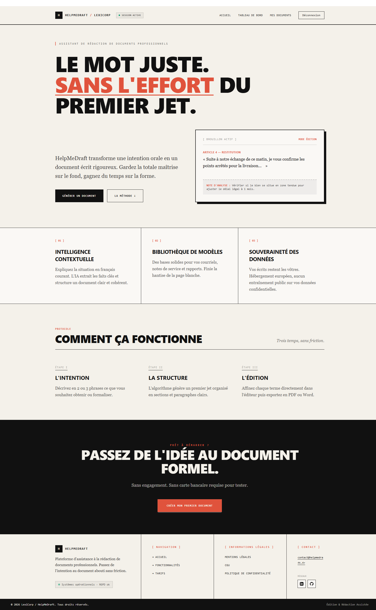

<div align="center">

# ✍️ HelpMeDraft

### Rédigez vos documents professionnels avec une IA qui ne sort jamais de chez vous.

Emails, notes de service, rapports — un éditeur Markdown augmenté par un modèle de langage **exécuté en local**, sans qu'une ligne de vos contenus ne parte chez un tiers.

<br>


<br>



</div>

---

> [!NOTE]
> **Projet en cours.** HelpMeDraft est le projet fil rouge du titre professionnel **Concepteur Développeur d'Applications (CDA)** — CD2IA 2025/2026, Metz Numeric School. Commanditaire fictif : **LexiCorp**, éditeur d'outils de gestion documentaire pour les PME.
> Le cœur fonctionnel est opérationnel ; tests automatisés, conteneurisation et CI/CD restent à construire — voir [l'état d'avancement](#-état-davancement).

<details>
<summary><b>📑 Sommaire</b></summary>

- [Pourquoi ce projet](#-pourquoi-ce-projet)
- [Fonctionnalités](#-fonctionnalités)
- [Stack technique](#%EF%B8%8F-stack-technique)
- [Architecture du dépôt](#-architecture-du-dépôt)
- [Démarrage rapide](#-démarrage-rapide)
- [Variables d'environnement](#-variables-denvironnement)
- [API](#-api)
- [Modèle de données](#%EF%B8%8F-modèle-de-données)
- [Sécurité](#-sécurité)
- [RGPD et accessibilité](#%EF%B8%8F-rgpd-et-accessibilité)
- [État d'avancement](#-état-davancement)
- [Auteur](#-auteur)

</details>

---

## 💡 Pourquoi ce projet

Les assistants de rédaction existants envoient le texte de l'utilisateur à une API distante. Pour une PME qui rédige des courriers RH, des comptes rendus ou des réponses clients, cela signifie confier des données personnelles à un tiers.

**HelpMeDraft prend le problème à l'envers** : le modèle tourne sur la machine de l'entreprise via [Ollama](https://ollama.com). Aucune clé API, aucune facture au token, aucun transfert hors infrastructure — et une conformité RGPD obtenue par l'architecture plutôt que par une clause contractuelle.

---

## ✨ Fonctionnalités

<table>
<tr>
<td width="50%" valign="top">

### 🔐 Comptes & sessions
- Inscription avec consentement RGPD explicite et tracé
- Connexion / déconnexion, rôles `user` et `admin`
- Réinitialisation du mot de passe par email (token à usage unique, 1 h)
- Refresh token en cookie `httpOnly` avec rotation

</td>
<td width="50%" valign="top">

### 🧠 Éditeur intelligent
- Markdown live (CodeMirror 6) + prévisualisation assainie
- Enregistrement automatique
- 3 actions IA : **reformuler**, **corriger**, **compléter**
- Portée au choix : sélection ou document entier
- Consigne libre transmise au modèle, insertion ou remplacement du résultat

</td>
</tr>
<tr>
<td width="50%" valign="top">

### 📁 Gestion documentaire
- CRUD documents, organisation en dossiers, filtrage
- Statuts `brouillon` · `a_relire` · `termine`
- Historique complet de chaque appel IA (avant / après, tokens)
- Statistiques personnelles

</td>
<td width="50%" valign="top">

### 🛠️ Back-office admin
- Liste paginée des utilisateurs avec compteurs d'usage
- Modification du rôle et du quota IA quotidien
- Suppression de compte, avec garde-fous
- Statistiques globales : comptes, documents par statut, appels IA sur 24 h et 7 jours

</td>
</tr>
</table>

Côté vitrine : pages publiques **Accueil**, **Fonctionnalités**, **Modèles**, **Tarifs**, ainsi que **Mentions légales**, **CGU** et **Politique de confidentialité**.

---

## ⚙️ Stack technique

| Domaine | Technologie |
|---|---|
| 🎨 Front-end | Vue 3 · TypeScript · Vite · Tailwind CSS 4 · daisyUI · Pinia · Vue Router |
| 📝 Éditeur | CodeMirror 6 (`@codemirror/lang-markdown`) + `marked` + `DOMPurify` |
| 🐍 Back-end | Python 3.11+ · Flask 3 · SQLAlchemy 2 |
| 🗄️ Base de données | SQLite en développement (cible MySQL en production) |
| 🤖 IA | **Ollama en local** (`qwen3:4b`) — aucune donnée envoyée à un service tiers |
| 🔑 Authentification | JWT HS256 (access 15 min) + refresh token `httpOnly` haché, avec rotation |
| ✉️ Emailing | Flask-Mail, sandbox Mailtrap en développement |

> [!TIP]
> **Choix technique — IA locale.** Le cahier des charges autorisait OpenAI *ou* un LLM local. Ollama a été retenu : les contenus rédigés ne quittent jamais l'infrastructure, ce qui répond directement à l'exigence RGPD « aucune donnée personnelle envoyée à un tiers sans anonymisation ». Aucune clé API n'est donc nécessaire.

---

## 🧱 Architecture du dépôt

```
HelpMeDraft/
├── backend/
│   ├── app/
│   │   ├── __init__.py          # factory create_app(), CORS, blueprints, handler 429
│   │   ├── config.py            # configuration lue depuis .env (fail fast si clé absente)
│   │   ├── extension.py         # instances Mail et Limiter
│   │   ├── routes/              # couche HTTP (validation + codes de retour)
│   │   │   ├── auth_routes.py   # inscription, login, refresh, logout, reset password
│   │   │   ├── document_route.py
│   │   │   ├── dossier_route.py
│   │   │   ├── ia_route.py      # génération IA + quota + historique
│   │   │   └── admin_route.py   # back-office, réservé au rôle admin
│   │   └── services/            # logique métier, sans dépendance à Flask/HTTP
│   │       ├── auth_service.py  # hachage, JWT, rotation des refresh tokens
│   │       ├── email_service.py
│   │       └── ia_service.py    # prompt engineering + appel Ollama
│   ├── database/db.py           # modèles SQLAlchemy et moteur
│   ├── run.py                   # point d'entrée de développement
│   └── requirements.txt         # versions figées (reproductibilité CI)
├── frontend/
│   └── src/
│       ├── index.ts             # routeur et guards (auth / guest / admin)
│       ├── views/               # une vue par route
│       ├── components/          # MarkdownEditor, Nav, Footer
│       ├── services/            # clients HTTP (axios) par domaine
│       ├── stores/auth.ts       # état d'authentification (Pinia)
│       └── types/               # types partagés front/API
├── docs/                        # maquettes, captures d'écran, veille, correctifs sécurité
├── .env.example
└── docker-compose.yml           # à écrire
```

Le backend suit une séparation stricte en trois couches :

```
routes  →  services  →  database
(HTTP)     (métier)     (persistance)
```

C'est cette séparation qui rend les composants métier testables **sans serveur Flask**.

---

## 🚀 Démarrage rapide

### Prérequis

| | Version |
|---|---|
| Python | 3.11+ |
| Node.js | 20+, avec **pnpm** |
| [Ollama](https://ollama.com) | installé et lancé localement |
| [Mailtrap](https://mailtrap.io) | sandbox gratuite, pour tester les emails |

### 1 · Cloner

```bash
git clone <url-du-depot>
cd HelpMeDraft---projet-fil-rouge
```

### 2 · Backend

```bash
cd backend
python -m venv .venv

source .venv/bin/activate     # macOS / Linux
.venv\Scripts\activate        # Windows

pip install -r requirements.txt
cp ../.env.example .env        # puis renseigner les valeurs (voir ci-dessous)
```

Les tables SQLite sont créées automatiquement au premier import de `database/db.py` — aucune migration à lancer en développement.

### 3 · Frontend

```bash
cd frontend
pnpm install
```

### 4 · Modèle IA

```bash
ollama pull qwen3:4b
ollama serve                   # écoute sur http://localhost:11434
```

### 5 · Lancer

Deux terminaux, plus Ollama en arrière-plan.

```bash
# Terminal 1 — backend (depuis backend/, venv activé)
python run.py          # → http://localhost:5000
```

```bash
# Terminal 2 — frontend (depuis frontend/)
pnpm dev               # → http://localhost:5173
```

> [!IMPORTANT]
> Le backend doit être lancé **depuis le dossier `backend/`** : les imports (`utilitaires`) et le chemin de la base SQLite sont relatifs au répertoire courant.

Pour promouvoir le premier compte en administrateur, passer son champ `role` à `admin` directement en base (`backend/HelpMeDraft.db`).

---

## 🔧 Variables d'environnement

Copier `.env.example` en `backend/.env`, puis renseigner :

| Variable | Rôle | Obligatoire |
|---|---|:---:|
| `JWT_SECRET_KEY` | Clé de signature des access tokens | ✅ |
| `APP_ENV` | `development` → cookie sans `Secure` ; toute autre valeur → `Secure` activé | ➖ (`development`) |
| `MAIL_SERVER`, `MAIL_PORT` | Serveur SMTP | ✅ |
| `MAIL_USERNAME`, `MAIL_PASSWORD` | Identifiants SMTP | ✅ |
| `MAIL_DEFAULT_SENDER` | Expéditeur des emails | ✅ |
| `MAIL_USE_TLS`, `MAIL_USE_SSL` | Chiffrement SMTP | ➖ (défauts fournis) |
| `OLLAMA_URL` | URL du serveur Ollama | ➖ (`http://localhost:11434`) |
| `OLLAMA_MODEL` | Modèle utilisé | ➖ (`qwen3:4b`) |
| `OLLAMA_THINK` | Mode raisonnement du modèle. **À laisser à `false`** — voir l'avertissement ci-dessous | ➖ (`false`) |
| `OLLAMA_NUM_CTX` | Fenêtre de contexte, en jetons | ➖ (`8192`) |
| `OLLAMA_CONNECT_TIMEOUT` | Délai pour établir la connexion à Ollama, en secondes. Aucun délai ne borne la génération elle-même | ➖ (`10`) |
| `IA_MAX_CONTENU_LENGTH` | Taille maximale du texte soumis à l'IA, en caractères | ➖ (`3000`) |
| `FRONTEND_URL` | Base du lien de réinitialisation | ➖ (`http://localhost:5173`) |

Générer une clé JWT robuste :

```bash
python -c "import secrets; print(secrets.token_urlsafe(64))"
```

> [!WARNING]
> `config.py` ne définit **aucune valeur de repli** pour `JWT_SECRET_KEY` : l'application refuse de démarrer sans elle. Le fichier `.env` est exclu par `.gitignore` et ne doit jamais être commité.

> [!IMPORTANT]
> **`OLLAMA_THINK` doit rester à `false`.** `qwen3` est un modèle à raisonnement : avec ce mode actif, il génère un bloc `<think>…</think>` avant sa réponse, de taille à peu près **constante**. Il « réfléchit » autant pour corriger `BJR` que pour reformuler trois pages — soit plusieurs minutes d'attente pour une phrase de quarante caractères sur une machine sans carte graphique. Ce mode n'apporte rien à des tâches de réécriture.
>
> **Ollama 0.9 minimum est requis** pour que ce réglage soit respecté. Vérifier avec `ollama --version` et mettre à jour si besoin. Avant la 0.9, le champ `think` de l'API n'existe pas : Ollama l'ignore **sans rien dire** et le modèle raisonne quand même. Le service envoie donc aussi la consigne `/no_think` dans le prompt, qui fonctionne sur toutes les versions, et retire le bloc de la réponse s'il arrive malgré tout — mais le temps de génération, lui, aura bien été payé.

---

## 🔌 API

Base : `http://localhost:5000`. Toutes les routes hors `/auth` exigent l'en-tête `Authorization: Bearer <access_token>`.

<details open>
<summary><b>🔐 Authentification</b></summary>

| Méthode | Route | Description |
|---|---|---|
| `POST` | `/auth/register` | Inscription (consentement RGPD requis) — 3 req./h |
| `POST` | `/auth/login` | Connexion — 5 req./min |
| `POST` | `/auth/refresh` | Renouvellement de l'access token (cookie `refresh_token`) |
| `POST` | `/auth/logout` | Déconnexion et révocation de la session |
| `GET` | `/auth/me` | Profil de l'utilisateur courant |
| `POST` | `/auth/forgot-password` | Envoi du lien de réinitialisation — 3 req./h |
| `POST` | `/auth/reset-password` | Définition du nouveau mot de passe |

</details>

<details>
<summary><b>📄 Documents et dossiers</b></summary>

| Méthode | Route | Description |
|---|---|---|
| `GET` / `POST` | `/documents` | Liste paginée (filtrable par dossier) / création |
| `GET` / `PUT` / `DELETE` | `/documents/<id>` | Lecture / mise à jour / suppression |
| `GET` | `/documents/stats` | Statistiques personnelles |
| `GET` / `POST` | `/dossiers` | Liste avec compteurs / création |
| `DELETE` | `/dossiers/<id>` | Suppression (les documents repassent à `id_dossier` nul) |

</details>

<details>
<summary><b>🤖 IA</b></summary>

| Méthode | Route | Description |
|---|---|---|
| `POST` | `/documents/<id>/ia/generer` | Génération. Corps : `type_action` (`reformuler` \| `corriger` \| `completer`), `scope` (`selection` \| `document`), `contenu`, `instructions` (facultatif). Renvoie `429` si le quota 24 h est atteint, `502` si Ollama est injoignable |
| `GET` | `/documents/<id>/ia/historique` | Historique des interactions du document |

</details>

<details>
<summary><b>🛡️ Administration — rôle <code>admin</code> requis</b></summary>

| Méthode | Route | Description |
|---|---|---|
| `GET` | `/admin/users` | Liste paginée avec compteurs d'usage |
| `PATCH` | `/admin/users/<id>` | Modification de `role` et `quota_daily_limit` |
| `DELETE` | `/admin/users/<id>` | Suppression d'un compte |
| `GET` | `/admin/stats` | Statistiques globales |

</details>

---

## 🗃️ Modèle de données

Sept entités, identifiants UUID, suppression en cascade depuis `user`.

| Table | Rôle |
|---|---|
| `user` | Compte, rôle, quota IA quotidien (20 par défaut) |
| `document` | Titre, contenu, format, statut, rattachement à un dossier |
| `dossier` | Regroupement de documents d'un utilisateur |
| `ia` | Journal des appels IA : action, contenu avant/après, tokens consommés |
| `consentement` | Traçabilité des consentements RGPD (type, acceptation, date) |
| `user_session` | Refresh tokens hachés, expiration, drapeau de révocation |
| `password_reset` | Tokens de réinitialisation hachés, expiration, usage unique |

> `PRAGMA foreign_keys=ON` est activé à chaque connexion : SQLite n'applique pas les contraintes de clé étrangère par défaut, et sans lui le `ondelete="SET NULL"` de `document.id_dossier` ne serait jamais exécuté.

---

## 🔒 Sécurité

### ✅ En place

| | Mesure |
|---|---|
| 🔑 | **Mots de passe** hachés avec bcrypt (sel automatique) — 8 caractères min., majuscule, minuscule, chiffre |
| ⏱️ | **Access token** JWT HS256, durée de vie 15 minutes, en-tête `Authorization` |
| 🔄 | **Refresh token** en cookie `httpOnly`, `SameSite=Strict`, limité au chemin `/auth`, **stocké haché** et **tourné à chaque usage** — la réutilisation d'un token consommé est traitée comme un vol et révoque toutes les sessions |
| 🧼 | **XSS** : la prévisualisation Markdown passe par `DOMPurify.sanitize()` entre `marked.parse()` et `v-html` ([détail du correctif](docs/securite-correctifs-2026-09-27.md)) |
| 🚨 | **Fail fast** : absence de `JWT_SECRET_KEY` → `RuntimeError` au démarrage, aucune clé de repli dans le code |
| 🔐 | **Cookie `Secure`** piloté par `APP_ENV` : désactivé en dev (localhost HTTP), obligatoire ailleurs |
| 📧 | **Réinitialisation** : seul le hash SHA-256 du token est stocké, expiration 1 h, usage unique, révocation de toutes les sessions après changement |
| 🕵️ | **Anti-énumération** : `/auth/forgot-password` répond à l'identique que l'email existe ou non |
| 🚦 | **Rate-limiting** sur les routes sensibles, réponse `429` normalisée |
| 👤 | **Contrôle d'accès** : appartenance vérifiée sur chaque document/dossier ; le rôle admin est relu **en base** à chaque appel, jamais depuis le JWT |
| 🧯 | **Garde-fous back-office** : un admin ne peut ni se retirer ses droits ni supprimer son propre compte |
| 💉 | **Injections SQL** : aucune requête par concaténation, paramétrage systématique par SQLAlchemy |
| 🌐 | **CORS** restreint à l'origine du frontend |
| ✔️ | **Validation d'entrée** systématique : types, longueurs, valeurs autorisées, bornes de quota et de pagination |

### 🚧 Points ouverts avant une mise en production

- [ ] `SECRET_KEY` Flask non configurée (sans impact actuel : ni session serveur, ni `flash()`)
- [ ] `ia.id_document` sans `ondelete` côté ORM, alors que `schema_mysql.sql` porte `ON DELETE CASCADE`
- [ ] Chiffrement des données sensibles au repos
- [ ] Test XSS de bout en bout à rejouer manuellement dans le navigateur
- [ ] Audit de sécurité complet et rapport associé

---

## ⚖️ RGPD et accessibilité

**RGPD**

- ✅ Consentement explicite recueilli à l'inscription et tracé en base (table `consentement`)
- ✅ Inférence IA entièrement locale : aucun contenu utilisateur transmis à un tiers
- ✅ Pages Mentions légales, CGU et Politique de confidentialité intégrées
- 🚧 Consentement distinct dédié à l'usage de l'IA
- 🚧 Export des données et suppression de compte à l'initiative de l'utilisateur

**Accessibilité (RGAA)**

- ✅ Chargement différé des routes, navigation cohérente
- 🚧 Couverture ARIA complète, contrastes, navigation clavier
- 🚧 Audit Lighthouse / WAVE et rapport associé

---

## 📊 État d'avancement

| Lot | État |
|---|:---:|
| Authentification et gestion de compte | ✅ Terminé |
| CRUD documents et dossiers | ✅ Terminé |
| Intégration IA (Ollama) et quotas | ✅ Terminé |
| Back-office administrateur | ✅ Terminé |
| Pages légales et vitrine | ✅ Terminé |
| Correctifs de sécurité (XSS, tokens, CSRF) | ✅ Terminé |
| Maquettes, captures et veille | 🔄 En cours |
| Tests automatisés (pytest, Vitest) et plan de test | ⬜ À faire |
| Conteneurisation Docker | ⬜ À faire (`docker-compose.yml` vide) |
| Pipeline CI/CD | ⬜ À faire |
| Migration vers MySQL et scripts SQL | ⬜ À faire |
| Audit accessibilité et sécurité | ⬜ À faire |
| Documentation utilisateur | ⬜ À faire |

---

## 👩‍💻 Auteur

<div align="center">

**Ophélie Bellissens** — CDA / CD2IA, Metz Numeric School

[](https://opheliebellissens.netlify.app)
[](https://linkedin.com/in/ophelie-bellissens-dev)

<sub>Projet pédagogique, non destiné à un usage commercial.</sub>

</div>
