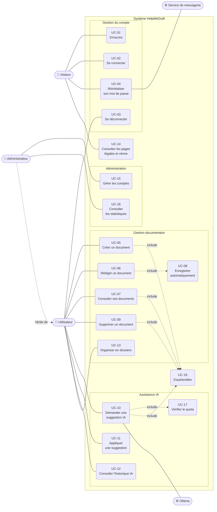

# 2 · Diagramme de cas d'utilisation

> **CP 5** — Analyser les besoins et maquetter une application
> Production exigée par le dossier de projet : « le diagramme du comportement des fonctionnalités de type cas d'utilisations ».

## 2.1 Diagramme

> **Note de lecture.** Mermaid ne propose pas de diagramme de cas d'utilisation UML natif.
> Les acteurs sont représentés par des nœuds arrondis à l'extérieur du système, les cas
> d'utilisation par des nœuds arrondis à l'intérieur, et les relations `<<include>>` par
> des flèches pointillées. L'administrateur **hérite** de l'utilisateur : il dispose de
> tous ses cas d'utilisation, plus les siens.

## 2.2 Description des cas d'utilisation

### UC-02 · Se connecter

| | |
|---|---|
| **Acteur principal** | Visiteur |
| **Préconditions** | L'acteur possède un compte |
| **Postconditions** | Un access token est en mémoire, un refresh token est posé en cookie, une ligne `user_session` existe |

**Scénario nominal**
1. L'acteur ouvre l'écran de connexion.
2. Il saisit son adresse mail et son mot de passe.
3. Le système vérifie le mot de passe contre l'empreinte bcrypt stockée.
4. Le système émet un access token JWT (15 min) et un refresh token (7 jours).
5. Le système enregistre l'empreinte SHA-256 du refresh token dans `user_session`.
6. Le système pose le refresh token en cookie `HttpOnly`, `SameSite=Strict`, `Path=/auth`.
7. Le système redirige vers le tableau de bord.

**Scénarios alternatifs**
- *A1 — Identifiants invalides* : le système répond `401` avec un message **indifférencié**
  (« Email ou mot de passe incorrect »), afin de ne pas révéler l'existence du compte.
- *A2 — Plus de 5 tentatives par minute* : Flask-Limiter répond `429`.
- *A3 — Champ manquant* : le système répond `400`.

---

### UC-10 · Demander une suggestion IA
**Cas d'utilisation le plus représentatif du projet** — il traverse les quatre couches.

| | |
|---|---|
| **Acteur principal** | Utilisateur |
| **Acteur secondaire** | Ollama |
| **Préconditions** | L'utilisateur est authentifié, le document lui appartient, son quota 24 h n'est pas atteint |
| **Postconditions** | Une ligne `ia` horodatée trace l'appel ; la suggestion est renvoyée sans être écrite dans le document |

**Scénario nominal**
1. L'utilisateur sélectionne du texte, ou cible le document entier.
2. Il choisit une action : compléter, reformuler ou corriger.
3. Il peut ajouter une consigne particulière (500 caractères maximum).
4. Le système vérifie l'access token.
5. Le système valide `type_action` et `scope` contre des listes blanches, et la taille du contenu (borne configurable par machine (3 000 caractères par défaut)).
6. Le système vérifie que le document appartient bien à l'utilisateur.
7. Le système compte les appels IA de l'utilisateur sur les 24 dernières heures et les compare à son quota.
8. Le système construit le prompt à partir du gabarit de l'action, puis y ajoute la consigne.
9. Le système appelle Ollama en local. L'appel n'est pas chronométré : une inférence sur processeur seul peut dépasser la minute, et l'interrompre afficherait une erreur alors que la génération aboutit. L'éditeur affiche pendant ce temps le délai écoulé et une estimation calculée sur la taille du texte.
10. Le système enregistre l'appel dans `ia` : action, contenu avant, contenu après, jetons consommés.
11. Le système renvoie la suggestion à l'éditeur, qui l'affiche **de façon différenciée**, sans écraser le texte.

**Scénarios alternatifs**
- *A1 — Action ou périmètre hors liste blanche* : `400`.
- *A2 — Contenu vide, ou au-delà au-delà de la borne configurée* : `400`.
- *A3 — Document inexistant ou appartenant à un autre utilisateur* : `404` — un `403` révélerait l'existence du document.
- *A4 — Quota atteint* : `429`, message indiquant la limite.
- *A5 — Ollama injoignable, ou délai dépassé* : `502`, message explicite ; aucune ligne `ia` n'est écrite.

> **Point de sécurité à souligner en soutenance.** Le scénario A3 renvoie `404` et non `403`.
> Un `403` confirmerait à un attaquant que l'identifiant de document existe — c'est une fuite
> d'information par énumération. La requête filtre toujours sur `(id_document, user_id)`
> conjointement, jamais sur l'identifiant seul.

---

### UC-17 · Vérifier le quota *(inclus dans UC-10)*

| | |
|---|---|
| **Règle appliquée** | RG-07 |
| **Mécanisme** | fenêtre **glissante** de 24 h, et non remise à zéro à minuit |
| **Calcul** | `COUNT(ia)` où `user_id` correspond et `created_at ≥ maintenant − 24 h`, comparé à `user.quota_daily_limit` (20 par défaut) |
| **Dépassement** | `HTTP 429` |

> Une fenêtre glissante évite l'effet de bord d'une remise à zéro à minuit, où un utilisateur
> consommerait 40 requêtes en deux heures à cheval sur le changement de jour.

---

### UC-15 · Gérer les comptes

| | |
|---|---|
| **Acteur principal** | Administrateur |
| **Préconditions** | L'acteur est authentifié et porte `role = "admin"` |

**Scénario nominal**
1. L'administrateur ouvre le back-office.
2. Le système vérifie le rôle **côté serveur** (`require_admin` en `before_request` du blueprint).
3. Le système liste les comptes, avec pour chacun son nombre de documents et d'appels IA.
4. L'administrateur peut modifier un rôle ou un quota, ou supprimer un compte.

**Scénarios alternatifs**
- *A1 — Utilisateur non administrateur* : `403`. Le garde de route côté client n'est qu'un
  confort d'interface ; **l'autorisation réelle est serveur**.

## 2.3 Matrice de traçabilité

| Cas d'utilisation | Besoins couverts | Écran | Point d'entrée API |
|---|---|---|---|
| UC-01 S'inscrire | BF-01 | `/register` | `POST /auth/register` |
| UC-02 Se connecter | BF-02 | `/login` | `POST /auth/login` |
| UC-03 Se déconnecter | BF-02 | barre de navigation | `POST /auth/logout` |
| UC-04 Réinitialiser son mot de passe | BF-03 | `/forgot-password`, `/reset-password` | `POST /auth/forgot-password`, `POST /auth/reset-password` |
| UC-05 Créer un document | BF-10 | `/documents/nouveau` | `POST /documents` |
| UC-06 Rédiger un document | BF-05 | `/documents/:id` | `PUT /documents/:id` |
| UC-07 Consulter ses documents | BF-10 | `/documents` | `GET /documents` |
| UC-08 Enregistrer automatiquement | BF-11 | `/documents/:id` | `PUT /documents/:id` |
| UC-09 Supprimer un document | BF-10 | `/documents` | `DELETE /documents/:id` |
| UC-10 Demander une suggestion IA | BF-06 à BF-08, BF-14, BF-15 | `/documents/:id` | `POST /documents/:id/ia/generer` |
| UC-11 Appliquer une suggestion | BF-09, BF-16 | `/documents/:id` | — (côté client) |
| UC-12 Consulter l'historique IA | BF-12 | `/documents/:id` | `GET /documents/:id/ia/historique` |
| UC-13 Organiser en dossiers | BF-13 | `/documents` | `GET`, `POST`, `DELETE /dossiers` |
| UC-14 Pages légales et vitrine | — | `/`, `/cgu`, `/mentions-legales`, `/confidentialite`, `/fonctionnalites`, `/tarifs`, `/modeles` | — |
| UC-15 Gérer les comptes | BF-04, BF-17 | `/admin` | `GET`, `PATCH`, `DELETE /admin/users` |
| UC-16 Consulter les statistiques | BF-18 | `/admin` | `GET /admin/stats` |
| UC-17 Vérifier le quota | BF-19 | — | inclus dans `POST /documents/:id/ia/generer` |
| UC-18 S'authentifier | BNF-01 | — | `token_required`, `POST /auth/refresh` |
