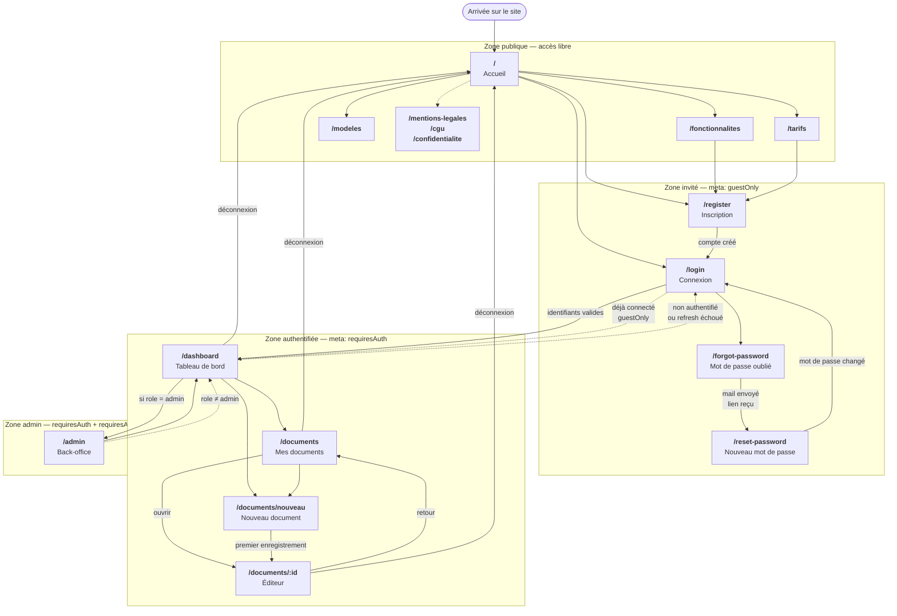
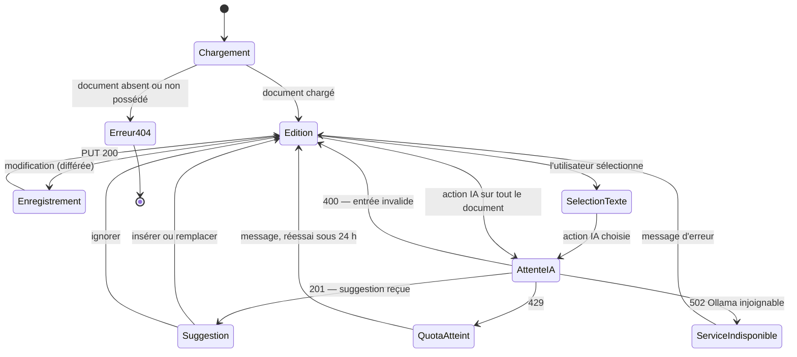

# 3 · Enchaînement des écrans

> **CP 5** — Analyser les besoins et maquetter une application
> *Critère de performance : « **L'enchainement des maquettes est formalisé par un schéma** ».*

Maquettes associées : [`docs/maquettes/`](../maquettes/) · captures de l'application réalisée : [`docs/captures/`](../captures/)

## 3.1 Schéma d'enchaînement

**Légende**

- Trait plein : navigation déclenchée par l'utilisateur
- Trait pointillé : redirection automatique du garde de navigation, ou lien de pied de page
- Les libellés en gras sont les chemins réels déclarés dans `frontend/src/index.ts`

## 3.2 Zones d'accès

Quatre zones, matérialisées par les métadonnées de route et contrôlées par un garde de navigation.

| Zone | Métadonnée | Écrans | Comportement du garde |
|---|---|---|---|
| Publique | *aucune* | `/`, `/fonctionnalites`, `/tarifs`, `/modeles`, `/mentions-legales`, `/cgu`, `/confidentialite` | accès libre |
| Invité | `guestOnly: true` | `/login`, `/register`, `/forgot-password`, `/reset-password` | un utilisateur déjà connecté est renvoyé vers `/dashboard` |
| Authentifiée | `requiresAuth: true` | `/dashboard`, `/documents`, `/documents/nouveau`, `/documents/:id` | sans session valide, redirection vers `/login` |
| Administration | `requiresAuth` + `requiresAdmin` | `/admin` | sans `role = "admin"`, redirection vers `/dashboard` |

> **Point de sécurité à souligner en soutenance.** Ce garde de navigation est un **confort
> d'interface**, pas un mécanisme de sécurité : il est entièrement contournable depuis la console
> du navigateur. L'autorisation réelle est serveur — `token_required` sur chaque route protégée,
> et `require_admin` en `before_request` du blueprint d'administration. Les deux niveaux sont
> nécessaires : le client pour l'ergonomie, le serveur pour la sécurité.

## 3.3 Écran central : l'éditeur

`/documents/:id` est l'écran qui porte la fonctionnalité la plus représentative du projet.

La suggestion est un **état distinct** de l'édition : elle est présentée à l'utilisateur sans
jamais écraser son texte. L'insertion ou le remplacement est une action explicite de sa part —
c'est l'exigence « intégration des suggestions dans l'éditeur (insertion ou remplacement) » et
« résultat affiché de manière différenciée » du cahier des charges.
