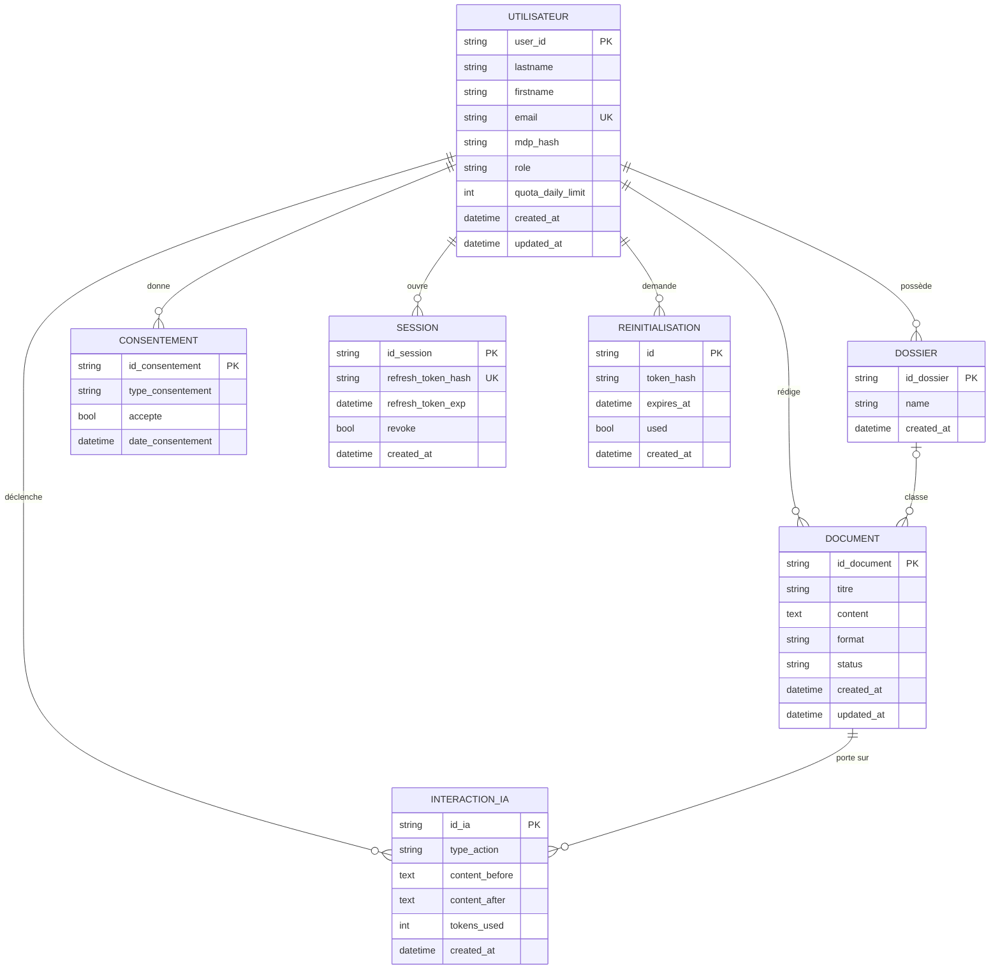
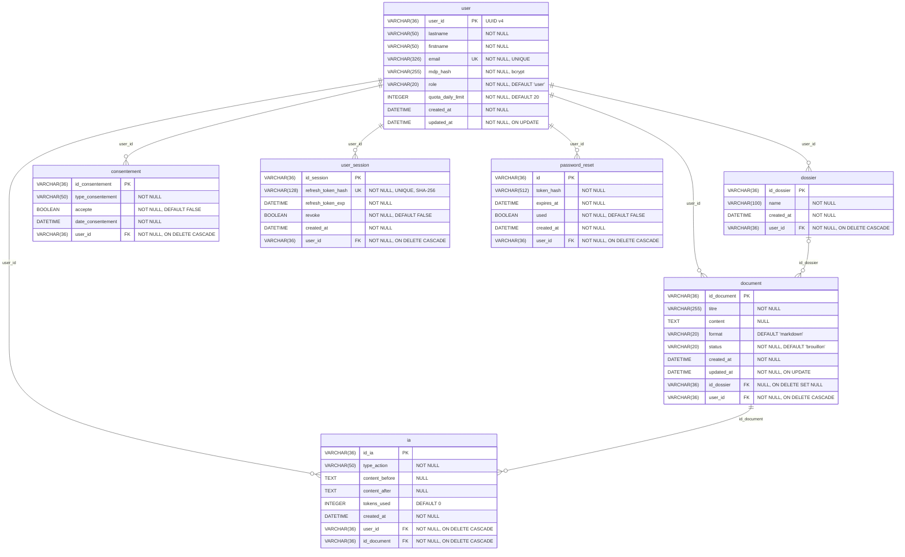

# 4 · Modèle de données

> **CP 7** — Concevoir et mettre en place une base de données relationnelle
> Productions exigées par le dossier de projet : « le modèle entités-associations et modèle physique de la base de données » et « le script de création ou de modification de la base de données ».

Script de création : [`backend/database/schema_mysql.sql`](../../backend/database/schema_mysql.sql)
Modèles ORM : [`backend/database/db.py`](../../backend/database/db.py)

## 4.1 Modèle conceptuel (entités-associations)

### Cardinalités, en notation Merise

| Association | Entité | Cardinalité | Lecture |
|---|---|---|---|
| **possède** | Utilisateur | (0,n) | un utilisateur possède zéro à n dossiers |
| | Dossier | (1,1) | un dossier appartient à un et un seul utilisateur |
| **rédige** | Utilisateur | (0,n) | un utilisateur rédige zéro à n documents |
| | Document | (1,1) | un document a un et un seul auteur |
| **classe** | Dossier | (0,n) | un dossier classe zéro à n documents |
| | Document | (0,1) | un document est classé dans **au plus un** dossier |
| **déclenche** | Utilisateur | (0,n) | un utilisateur déclenche zéro à n interactions IA |
| | Interaction IA | (1,1) | une interaction a un et un seul demandeur |
| **porte sur** | Document | (0,n) | un document porte zéro à n interactions IA |
| | Interaction IA | (1,1) | une interaction concerne un et un seul document |
| **donne** | Utilisateur | (0,n) | un utilisateur donne zéro à n consentements |
| | Consentement | (1,1) | un consentement émane d'un seul utilisateur |
| **ouvre** | Utilisateur | (0,n) | un utilisateur ouvre zéro à n sessions (plusieurs appareils) |
| | Session | (1,1) | une session appartient à un seul utilisateur |
| **demande** | Utilisateur | (0,n) | un utilisateur demande zéro à n réinitialisations |
| | Réinitialisation | (1,1) | une demande émane d'un seul utilisateur |

**Choix de conception à défendre**

- **`INTERACTION_IA` porte deux clés étrangères** (`user_id` et `id_document`), alors que
  l'auteur du document est déductible par transitivité. C'est une dénormalisation **volontaire** :
  le calcul du quota (RG-07) et les statistiques du back-office interrogent les appels IA
  **par utilisateur**, sans se soucier des documents. Sans `user_id` direct, chaque vérification
  de quota — c'est-à-dire chaque appel IA — imposerait une jointure. Le coût est une contrainte
  de cohérence à maintenir ; le gain est sur le chemin critique de la fonctionnalité centrale.
- **`DOCUMENT.id_dossier` est facultatif**, cardinalité (0,1) : un document peut rester non classé.
  Le classement est un confort, pas un prérequis à la rédaction.
- **`CONSENTEMENT` est une entité, pas un booléen sur l'utilisateur.** Le RGPD exige de pouvoir
  **prouver** le consentement : il faut son type, sa date, et conserver l'historique des
  changements d'avis. Un booléen écrasé à chaque modification ne constitue pas une preuve.
- **Aucun jeton n'est stocké en clair.** `SESSION.refresh_token_hash` et
  `REINITIALISATION.token_hash` ne contiennent que des empreintes SHA-256. Une fuite de la base
  ne permet donc pas de rejouer une session active (RG-10).

## 4.2 Modèle physique

### Règles de passage du conceptuel au physique

1. Chaque entité devient une table ; son identifiant devient clé primaire.
2. Toute association **un à plusieurs** se traduit par une clé étrangère portée par la table du
   côté (1,1) — ici les six tables filles de `user`, et `ia` vers `document`.
3. L'association **classe**, de cardinalité (0,1) côté document, donne une clé étrangère
   **nullable** sur `document`.
4. Aucune association plusieurs à plusieurs dans ce modèle : aucune table de jonction nécessaire.

### Conventions de nommage

| Objet | Convention | Exemple |
|---|---|---|
| Table | singulier, minuscules, `snake_case` | `user_session` |
| Clé primaire | `id_<entité>`, sauf `user_id` et `id` | `id_document` |
| Clé étrangère | nom identique à la clé primaire référencée | `document.user_id` |
| Horodatage | `created_at`, `updated_at` | — |
| Identifiant | UUID v4 en `VARCHAR(36)` | — |

> **Pourquoi des UUID et non des entiers auto-incrémentés ?** Un identifiant séquentiel exposé
> dans une URL (`/documents/42`) invite à l'énumération : un attaquant essaie 41, 43, 44. Avec un
> UUID v4, l'espace est non devinable. La protection réelle reste le filtrage par `user_id`
> (RG-01), mais l'UUID retire l'incitation et limite la fuite d'information volumétrique —
> `/documents/1337` révèle qu'au moins 1337 documents existent.

### Intégrité référentielle

| Suppression | Effet | Justification |
|---|---|---|
| un **utilisateur** | `CASCADE` sur ses 6 tables liées | droit à l'effacement, RGPD art. 17 : aucune donnée orpheline |
| un **dossier** | `SET NULL` sur `document.id_dossier` | supprimer un classement ne doit pas détruire le travail (RG-03) |
| un **document** | `CASCADE` sur `ia` | l'historique IA n'a pas de sens sans son document |

> ⚠️ **Écart identifié entre l'ORM et le SQL.** `schema_mysql.sql` déclare bien
> `ON DELETE CASCADE` sur `ia.id_document`, mais le modèle ORM `IA.id_document` ne porte pas
> `ondelete="CASCADE"`. L'intégrité tient donc au niveau du SGBD mais pas au niveau de
> l'application. À corriger — voir [TODO](../../TODO.md) §6.

## 4.3 Sécurité et confidentialité des données

> *Critère de performance CP7 : « L'intégrité, la sécurité et la confidentialité des données est assurée ».*

| Donnée | Sensibilité | Protection en place | Reste à faire |
|---|---|---|---|
| Mot de passe | critique | bcrypt avec sel, jamais stocké en clair | — |
| Refresh token | critique | empreinte SHA-256 seule, rotation, détection de rejeu | — |
| Jeton de réinitialisation | critique | empreinte seule, expiration, usage unique (`used`) | — |
| Contenu des documents | personnel | cloisonnement par `user_id`, inférence locale (aucune sortie vers un tiers) | **chiffrement au repos** |
| Historique IA | personnel | cloisonnement par `user_id` | **chiffrement au repos** |
| Identité, adresse mail | personnel | unicité de l'adresse, `CASCADE` à la suppression | **chiffrement au repos** |
| Consentement | preuve légale | tracé, horodaté, conservé | consentement IA distinct |

**Comptes et droits SGBD** — non réalisés : l'application tourne actuellement sur SQLite, qui n'a
pas de gestion de comptes. C'est le principal argument pour la migration vers MySQL, qui permet
d'appliquer le moindre privilège : un compte applicatif limité à `SELECT`, `INSERT`, `UPDATE`,
`DELETE` sur le schéma, distinct du compte de migration qui seul porte les droits `DDL`.
Voir [TODO](../../TODO.md) §6.
