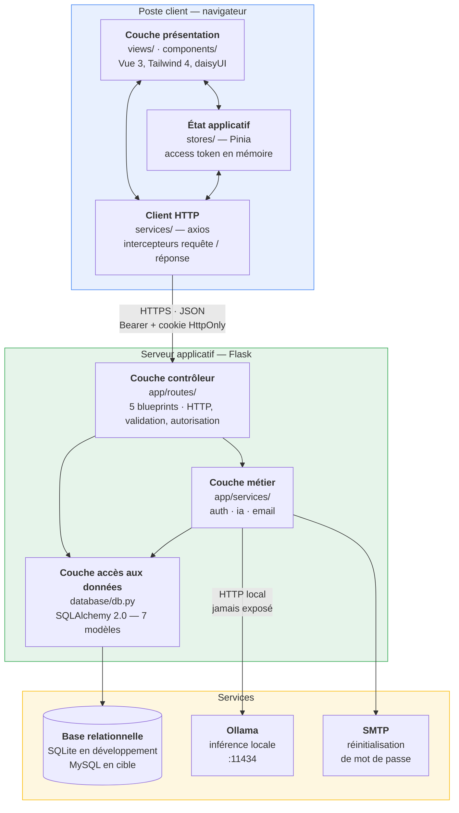
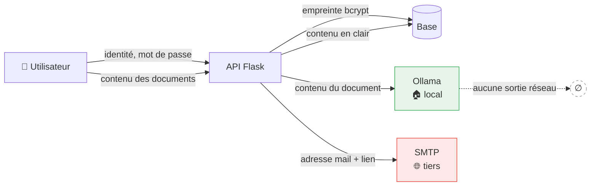

# 5 · Architecture logicielle

> **CP 6** — Définir l'architecture logicielle d'une application
> *Critères de performance : architecture multicouche répartie conforme aux bonnes pratiques · **rôle de chaque couche défini en tenant compte de la stratégie de sécurité** · **besoins d'éco-conception identifiés**.*

## 5.1 Vue d'ensemble

Architecture **multicouche répartie** : une application monopage découplée d'une API REST sans
état, elle-même adossée à une base relationnelle et à un service d'inférence local.

> **« Répartie » en quoi ?** Trois processus distincts communiquent par le réseau : le navigateur,
> le serveur Flask, et le serveur d'inférence Ollama — auxquels s'ajoutent le SGBD et le relais
> SMTP. Chacun peut être déplacé sur une autre machine sans toucher au code des autres, seule la
> configuration change (`OLLAMA_URL`, chaîne de connexion, `MAIL_SERVER`).

## 5.2 Rôle de chaque couche et stratégie de sécurité

> La stratégie suit le principe de **défense en profondeur** : chaque couche se protège
> elle-même et ne fait jamais confiance à la couche appelante.

### Couche présentation — `frontend/src/views/`, `components/`

| | |
|---|---|
| **Responsabilité** | afficher, collecter la saisie, restituer les erreurs |
| **Ne fait pas** | aucune règle métier, aucune décision d'autorisation |
| **Sécurité** | assainissement du Markdown rendu par **DOMPurify** avant insertion dans le DOM ; validation de formulaire ; garde de navigation |
| **Menace traitée** | **XSS stocké** — un document contenant `` est neutralisé au rendu |
| **Limite assumée** | tout ce qui est fait ici est contournable. La validation client est ergonomique, jamais sécuritaire. |

### État applicatif — `frontend/src/stores/`

| | |
|---|---|
| **Responsabilité** | détenir la session courante et l'identité de l'utilisateur |
| **Sécurité** | l'**access token reste en mémoire** (store Pinia), jamais en `localStorage` |
| **Menace traitée** | **exfiltration de jeton par XSS** — `localStorage` est lisible par tout script de la page ; une variable JavaScript disparaît au rechargement |
| **Conséquence** | au rechargement, la session est reconstruite via `POST /auth/refresh`, qui s'appuie sur le cookie `HttpOnly` — lui, inaccessible à JavaScript |

### Client HTTP — `frontend/src/services/`

| | |
|---|---|
| **Responsabilité** | centraliser les appels à l'API ; un module par domaine |
| **Sécurité** | intercepteur de requête injectant l'en-tête `Authorization` ; intercepteur de réponse renouvelant le jeton sur `401` |
| **Détail notable** | les `401` concurrents sont **mutualisés** : un seul appel à `/auth/refresh` est émis, les requêtes en attente sont rejouées avec le nouveau jeton. Sans cela, dix requêtes simultanées déclencheraient dix rotations de refresh token — et la détection de rejeu invaliderait la session. |
| **Garde-fous** | pas de nouvelle tentative sur `/refresh` lui-même, et une seule par requête : pas de boucle infinie |

### Couche contrôleur — `backend/app/routes/`

| | |
|---|---|
| **Responsabilité** | frontière HTTP : désérialiser, **valider**, **autoriser**, orchestrer, sérialiser, choisir le code de statut |
| **Sécurité** | `token_required` sur chaque route protégée ; `require_admin` en `before_request` du blueprint d'administration ; **validation systématique des entrées par liste blanche** ; CORS restreint à une seule origine ; rate limiting Flask-Limiter |
| **Menaces traitées** | accès horizontal — chaque requête filtre sur `(identifiant, user_id)` conjointement ; escalade de privilèges — rôle vérifié serveur ; bourrage d'identifiants — 5 connexions/min, 3 réinitialisations/heure ; déni de service par charge utile — contenu plafonné à 20 000 caractères, instructions à 500 |
| **Principe** | **c'est la seule couche qui parle HTTP.** Les services ne connaissent ni `request` ni les codes de statut ; ils lèvent des exceptions que le contrôleur traduit. |

### Couche métier — `backend/app/services/`

| | |
|---|---|
| **Responsabilité** | règles de gestion indépendantes du transport : hachage et jetons (`auth_service`), construction de prompts et appel au modèle (`ia_service`), envoi de mail (`email_service`) |
| **Sécurité** | bcrypt avec sel ; JWT HS256 ; refresh token de 64 octets issu de `secrets.token_urlsafe`, stocké en empreinte SHA-256, **tourné à chaque usage avec détection de rejeu** ; délai maximum de 60 s sur l'appel au modèle |
| **Menaces traitées** | vol de base de mots de passe — bcrypt rend l'attaque par dictionnaire coûteuse ; rejeu de session — un jeton réutilisé invalide la session entière ; blocage du serveur — délai maximum puis `502` propre |
| **Écart à corriger** | ces services sont des **modules de fonctions**, pas des classes. CP3 évalue « les bonnes pratiques de la POO sont respectées ». À refactorer, ou à assumer explicitement devant le jury comme un choix de style idiomatique en Python pour des services sans état. |

### Couche accès aux données — `backend/database/db.py`

| | |
|---|---|
| **Responsabilité** | définir les 7 modèles, exposer les sessions, porter les contraintes d'intégrité |
| **Sécurité** | **ORM SQLAlchemy 2.0 exclusivement** : toutes les requêtes sont paramétrées, aucune concaténation de SQL ; `ON DELETE CASCADE` et `SET NULL` ; empreintes de jetons uniquement |
| **Menace traitée** | **injection SQL** — éliminée par construction, les paramètres ne sont jamais interprétés comme du SQL |
| **Reste à faire** | chiffrement au repos, transactions explicites, comptes SGBD au moindre privilège |

### Analyse DICP

> *CP6 : « Connaissance des indicateurs de sécurité des systèmes d'information : disponibilité, intégrité, confidentialité, preuve ».*

| Indicateur | Mécanismes en place | Reste à faire |
|---|---|---|
| **Disponibilité** | rate limiting ; délai maximum sur l'inférence puis `502` explicite ; chargement différé des routes | supervision, sauvegardes |
| **Intégrité** | contraintes de clés étrangères ; validation par liste blanche à chaque entrée ; `updated_at` automatique | transactions explicites sur les écritures composées |
| **Confidentialité** | bcrypt ; access token en mémoire ; refresh token en cookie `HttpOnly` ; cloisonnement par `user_id` ; **inférence locale : aucune donnée ne quitte l'infrastructure** | chiffrement au repos ; comptes SGBD au moindre privilège |
| **Preuve** | table `ia` horodatée (qui, quand, quelle action, quel contenu avant et après) ; table `consentement` ; table `user_session` | journal d'audit des actions d'administration |

## 5.3 Patrons de conception

| Patron | Où | Pourquoi |
|---|---|---|
| **Architecture en couches** | contrôleur → métier → données | isoler les responsabilités, rendre chaque couche testable séparément |
| **Mapping objet-relationnel** | SQLAlchemy `DeclarativeBase` | abstraire le SGBD et supprimer l'injection SQL par construction |
| **Décorateur** | `@token_required`, `@limiter.limit` | appliquer une préoccupation transversale sans la dupliquer dans chaque route |
| **Intercepteur** | intercepteurs axios | injection du jeton et renouvellement sur `401`, sans toucher aux appels métier |
| **Fabrique applicative** | `create_app()` dans `app/__init__.py` | instancier l'application avec une configuration variable — indispensable pour tester |
| **Magasin centralisé** | store Pinia `auth` | une seule source de vérité pour la session, partagée par toutes les vues |
| **Gabarit de prompt** | `PROMPT_TEMPLATES` | « prompt engineering dynamique » exigé par le cahier des charges : un gabarit par action, paramétré par le contenu et la consigne |

### Patrons de sécurité

| Patron | Mise en œuvre |
|---|---|
| **Défense en profondeur** | validation côté client **et** côté serveur ; garde de navigation **et** `token_required` |
| **Échec sécurisé** | `config.py` **refuse de démarrer** sans `JWT_SECRET_KEY`, plutôt que de se replier sur une clé en dur connue de quiconque lit le dépôt |
| **Moindre privilège** | cookie de refresh limité à `Path=/auth` ; CORS limité à une seule origine |
| **Liste blanche plutôt que liste noire** | `type_action`, `scope`, `status`, `format` validés contre des ensembles fermés |
| **Messages indifférenciés** | « Email ou mot de passe incorrect » ne révèle pas si le compte existe ; `404` plutôt que `403` sur un document d'autrui |
| **Secret non rejouable** | la base ne contient que des empreintes de jetons, jamais les jetons |

## 5.4 Besoins d'éco-conception

> *Critère de performance CP6 : « Les besoins d'éco-conception de l'application sont identifiés ».*
> L'identification est la compétence évaluée ; la réalisation est suivie dans le [TODO](../../TODO.md) §11.

| # | Besoin identifié | État | Levier |
|---|---|---|---|
| ECO-01 | Ne charger que le code de l'écran visité | ✅ fait | les 16 routes sont en import différé |
| ECO-02 | Compresser les réponses HTTP | ⬜ à faire | GZIP ou Brotli au service des fichiers statiques |
| ECO-03 | Limiter le poids des dépendances | 🔄 à auditer | 13 dépendances front ; mesurer le bundle et arbitrer |
| ECO-04 | Éviter les appels d'inférence inutiles | 🔄 partiel | le quota plafonne l'usage ; un **cache des suggestions identiques** éviterait de recalculer |
| ECO-05 | Limiter le trafic de l'enregistrement automatique | ⬜ à faire | déclenchement différé plutôt qu'à chaque frappe |
| ECO-06 | Dimensionner le modèle au besoin | 🔄 à arbitrer | l'inférence est le poste de consommation dominant ; un modèle plus petit suffit pour corriger l'orthographe |
| ECO-07 | Ne transférer que les champs utiles | 🔄 à auditer | la liste des documents ne devrait pas renvoyer le contenu intégral |
| ECO-08 | Alléger les images | 🔄 à auditer | formats modernes, dimensions adaptées à l'affichage |

> **L'argument à porter en soutenance.** Le poste de consommation dominant d'une application d'IA
> générative n'est ni le réseau ni la base : c'est l'inférence. Les deux leviers qui comptent sont
> donc **ECO-04** (ne pas recalculer deux fois la même chose) et **ECO-06** (ne pas mobiliser un
> modèle de 8 milliards de paramètres pour corriger une faute d'accord). L'inférence locale sert
> aussi cet objectif : elle supprime l'aller-retour réseau vers un centre de données distant.

## 5.5 Flux de données personnelles

> Vue utile pour l'analyse RGPD : où vont les données, et où elles ne vont pas.

**Lecture.** Un seul tiers reçoit une donnée personnelle : le relais SMTP, et uniquement
l'adresse mail lors d'une réinitialisation de mot de passe. **Le contenu des documents ne quitte
jamais l'infrastructure** — c'est l'effet direct du choix d'Ollama, et la réponse à la contrainte
RGPD du cahier des charges (« aucune donnée personnelle ne doit être envoyée à OpenAI sans
anonymisation »). Le point faible restant est le stockage en clair en base : voir
[TODO](../../TODO.md) §8.
