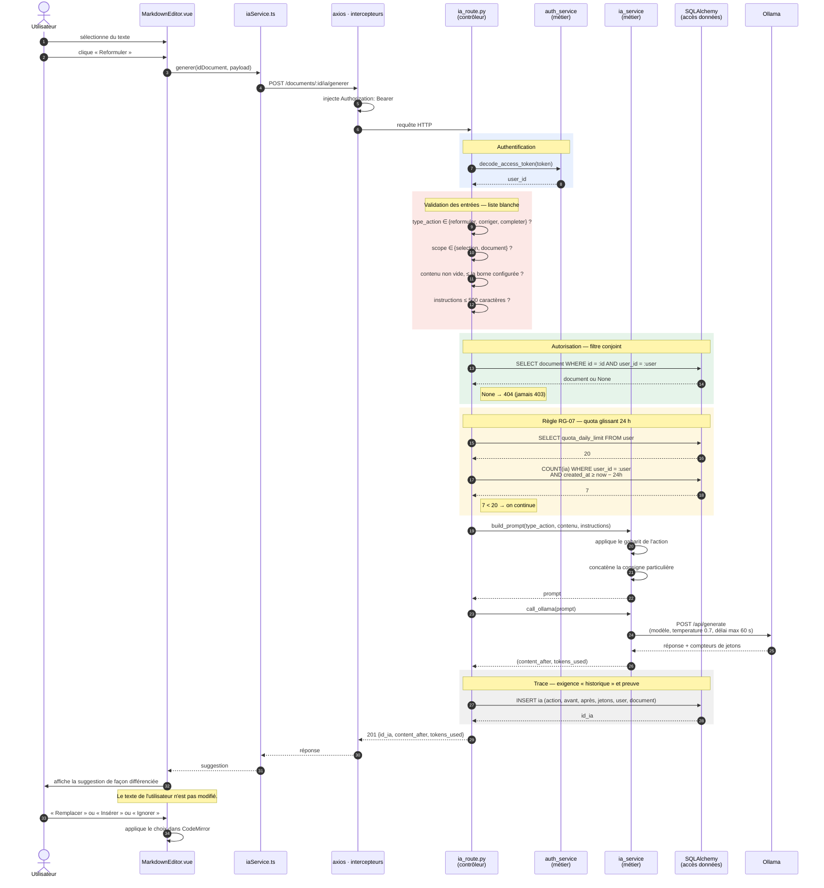
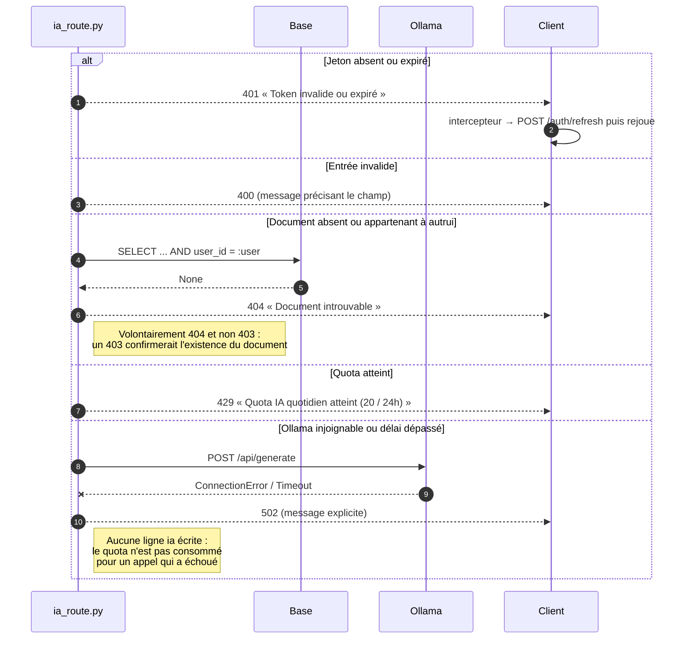
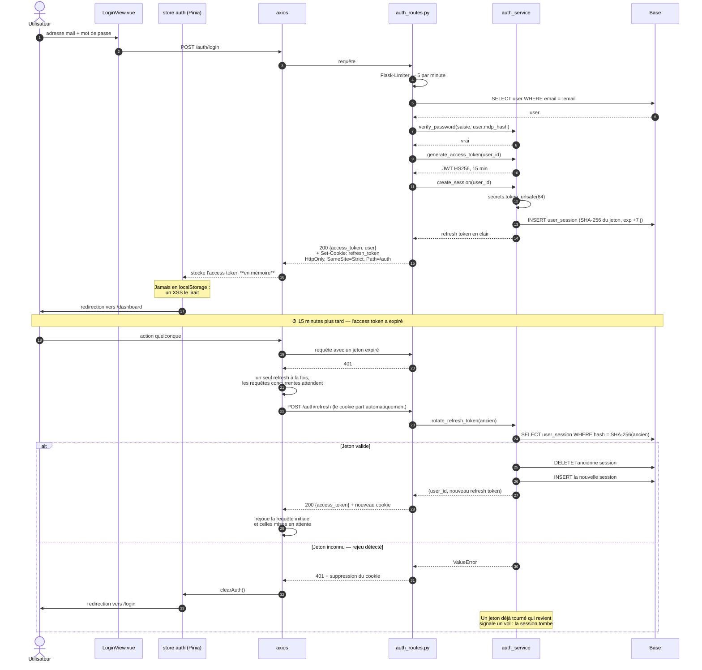
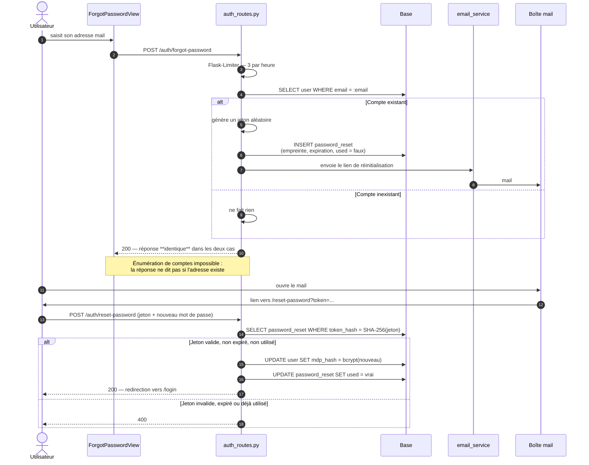

# 6 · Diagrammes de séquence

> **CP 5 / CP 6** — Production exigée par le dossier de projet : « le diagramme du détail des cas d'utilisations les plus significatifs de type diagramme de séquence ».

## 6.1 UC-10 · Demander une suggestion IA

**Le cas d'utilisation le plus représentatif du projet** : il traverse les quatre couches,
mobilise l'authentification, l'autorisation, la validation des entrées, une règle de gestion
(le quota), un service externe et l'écriture d'une trace.

### Chemins d'erreur

> **Point à souligner en soutenance.** L'ordre des contrôles n'est pas arbitraire :
> authentification, puis validation des entrées, puis autorisation, puis quota, puis seulement
> l'appel coûteux au modèle. Chaque contrôle est placé avant celui qui coûte plus cher. Valider
> le quota avant de vérifier la propriété du document reviendrait à faire payer un appel de
> quota à quelqu'un qui n'a pas accès au document.

## 6.2 UC-02 · Se connecter, puis renouveler la session

### Pourquoi deux jetons

| | Access token | Refresh token |
|---|---|---|
| **Durée** | 15 minutes | 7 jours |
| **Stockage** | mémoire JavaScript | cookie `HttpOnly` |
| **Lisible par JavaScript** | oui | **non** |
| **Transmis** | en-tête `Authorization` | automatiquement, aux seules routes `/auth` |
| **En base** | rien (JWT auto-porteur) | empreinte SHA-256 |
| **Si volé** | 15 minutes d'exposition | détecté à la première rotation, session invalidée |

> **Le compromis, formulé simplement.** Un jeton long en mémoire serait perdu à chaque
> rechargement de page. Un jeton long en `localStorage` serait exfiltrable par XSS. La
> combinaison retenue — jeton court en mémoire, jeton long en cookie `HttpOnly` avec rotation —
> donne une session persistante dont le secret durable n'est jamais exposé à JavaScript.
> `SameSite=Strict` et `Path=/auth` ferment la surface CSRF que le cookie ouvrirait sinon.

## 6.3 UC-04 · Réinitialiser son mot de passe

> **Trois propriétés à défendre.** La réponse est identique que le compte existe ou non — sinon
> le formulaire devient un oracle d'existence de comptes. Le jeton n'est stocké qu'en empreinte —
> une fuite de la base ne permet pas de réinitialiser les mots de passe. Le drapeau `used`
> garantit l'usage unique — un lien intercepté dans un historique de navigation ne resservira pas.
