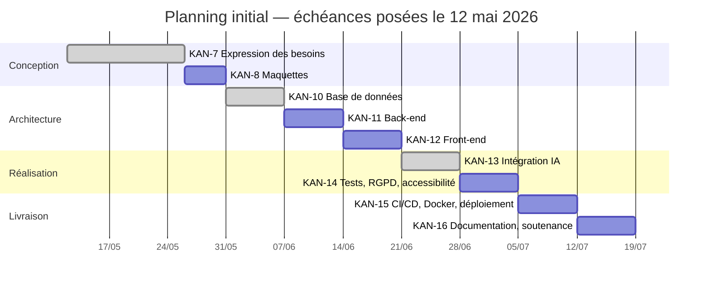

# Gestion de projet — HelpMeDraft

> **CP 4** — Contribuer à la gestion d'un projet informatique
> *Critères de performance : tâches planifiées en fonction du délai · **suivi rapproché de la planification, retards identifiés, acteurs alertés** · procédures qualité mises en œuvre · environnement de développement adéquat · outils collaboratifs choisis selon la méthode · comptes rendus structurés.*

Outil de suivi : **Jira** — projet `KAN` « HelpMeDraft projet fil rouge »
<https://helpmedraft.atlassian.net/jira/software/projects/KAN>
Données de ce document relevées le **3 octobre 2026**.

---

## 1 · Méthode et organisation

**Démarche retenue : itérative, de type Kanban.** Le cahier des charges fournit un plan de
développement en six étapes séquentielles, mais la réalité d'un projet mené seul sur plusieurs
mois impose des retours en arrière constants — on découvre une contrainte de sécurité en codant,
on révise le modèle de données après coup. Un flux continu avec priorisation régulière
correspond mieux à cette réalité qu'un découpage en sprints de durée fixe, qui suppose une
capacité stable que l'alternance cours / projet ne permet pas.

**Projet Jira de type « équipe gérée » (next-gen)**, tableau Kanban à trois colonnes :
À faire → En cours → Terminé.

### Environnement humain

| Rôle | Qui | Responsabilité |
|---|---|---|
| Maîtrise d'ouvrage | LexiCorp (contexte du cahier des charges) | exprime le besoin, arbitre le périmètre |
| Maîtrise d'œuvre | Ophélie Bellissens | conception, développement, tests, déploiement, documentation |
| Référent pédagogique | formateur MNS | valide les livrables, joue le rôle du commanditaire aux points d'étape |
| Jury | jury du titre CDA | destinataire final du dossier et de la soutenance |

Projet mené **en autonomie complète** — le REAC prévoit ce cas : « pour les projets de petite
taille ou au sein de petites entreprises, le concepteur développeur d'applications peut mener en
autonomie la gestion complète d'un projet informatique ».

### Outils collaboratifs

| Besoin | Outil | Pourquoi celui-là |
|---|---|---|
| Suivi des tâches | Jira | hiérarchie epic → tâche adaptée au découpage en phases du cahier des charges ; historique daté exploitable pour le suivi |
| Gestion de versions | Git + GitHub | branches par fonctionnalité, pull requests, historique traçable |
| Documentation | Markdown versionné dans le dépôt | la documentation évolue avec le code, dans le même commit, et se relit en revue |
| Maquettage | capture et export dans `docs/maquettes/` | — |

> **Le choix à défendre.** Documentation en Markdown **dans le dépôt** plutôt que dans Confluence
> ou un traitement de texte : une documentation séparée du code diverge en quelques semaines.
> Versionnée à côté de lui, elle se modifie dans le commit qui change le comportement décrit, et
> un écart se voit en relisant le diff.

---

## 2 · Structure du backlog

**101 tickets** répartis en 9 epics, qui reprennent les six étapes du plan de développement du
cahier des charges, avec les phases d'architecture et de réalisation éclatées en trois
(base de données, back-end, front-end).

| Type | Nombre |
|---|---:|
| Epic | 9 |
| Story | 7 |
| Tâche | 84 |
| Bug | 1 |
| **Total** | **101** |

Dix tickets ne sont rattachés à aucun epic : les six stories de jalon (`KAN-1` à `KAN-6`, qui
doublonnent les epics) et quatre tâches ajoutées en août (`KAN-89` à `KAN-92`). **À corriger** —
un ticket hors hiérarchie n'apparaît dans aucun suivi d'avancement.

---

## 3 · Planification initiale

Backlog créé le **12 mai 2026**, échéances posées au niveau des epics, en suivant les durées
indicatives du cahier des charges.



---

## 4 · Suivi et identification des écarts

> C'est le cœur du critère de performance : *« Le suivi des tâches est mis en rapprochement avec
> la planification, les éventuels retards sont identifiés et les acteurs concernés sont alertés ».*

### Avancement global au 3 octobre 2026

| État | Tickets | Part |
|---|---:|---:|
| Terminé | 48 | 47,5 % |
| En cours | 14 | 13,9 % |
| À faire | 39 | 38,6 % |

### Écart par epic

| Epic | Échéance | Clos le | **Écart** | Tâches (fini / cours / à faire) |
|---|---|---|---:|---|
| KAN-7 Expression des besoins | 26/05 | 02/10 | **+129 j** | 5 / 0 / 0 |
| KAN-8 Maquettes | 31/05 | — | **+125 j** | 6 / 0 / 1 |
| KAN-10 Base de données | 07/06 | 10/06 | **+3 j** | 6 / 1 / 0 |
| KAN-11 Back-end | 14/06 | — | **+111 j** | 6 / 1 / 7 |
| KAN-12 Front-end | 21/06 | — | **+104 j** | 7 / 1 / 5 |
| KAN-13 Intégration IA | 28/06 | 02/10 | **+96 j** | 7 / 0 / 4 |
| KAN-14 Tests, RGPD, accessibilité | 05/07 | — | **+90 j** | 0 / 1 / 5 |
| KAN-15 CI/CD, Docker, déploiement | 12/07 | — | **+83 j** | 1 / 0 / 10 |
| KAN-16 Documentation, soutenance | 19/07 | — | **+76 j** | 0 / 2 / 6 |

**Toutes les échéances sont dépassées.** La seule tenue à peu près est KAN-10 (+3 jours). Le
jalon final était fixé au 19 juillet : le retard sur la fin de projet est de **76 jours**.

### Vélocité mensuelle

```
2026-05 :  6 ██████
2026-06 :  9 █████████
2026-07 :  2 ██
2026-08 : 18 ██████████████████
2026-09 :  0
2026-10 : 13 █████████████   (sur 2 jours)
```

Deux creux marqués : **juillet** (2 tickets clos) et **septembre** (aucun). Ils expliquent
l'essentiel du retard. À l'inverse, août et le début octobre montrent une capacité réelle de
13 à 18 tickets par mois quand le temps est disponible. **Le problème n'est pas la capacité,
c'est la discontinuité.** Une planification honnête doit donc raisonner en semaines
effectivement travaillées, pas en semaines calendaires — c'est l'erreur de la planification
initiale, qui a repris les durées du cahier des charges comme si le projet était à temps plein.

### Incohérences d'état relevées

| Epic | Problème |
|---|---|
| KAN-10 « Architecture BDD » | marqué **Terminé** alors que `KAN-34` (gestion des accès et permissions) est encore *En cours* |
| KAN-13 « Intégration IA » | marqué **Terminé** alors que 4 tâches restent *À faire* : `KAN-53`, `KAN-61`, `KAN-62`, `KAN-84` |

Un epic fermé au-dessus de tâches ouvertes fausse l'indicateur d'avancement : le tableau
affiche une phase terminée qui ne l'est pas. À corriger avant la soutenance — un jury qui ouvre
le Jira le verra.

### Analyse des causes

| Cause | Constat | Correctif |
|---|---|---|
| Planification calendaire irréaliste | durées du cahier des charges reprises telles quelles, sans tenir compte de l'alternance | replanifier en semaines travaillées |
| Interruptions longues | juillet et septembre quasi vides | accepter les creux dans le plan plutôt que les subir |
| Sous-estimation du travail documentaire | les epics les plus en retard sont KAN-14, KAN-15, KAN-16 — tests, déploiement, documentation | ces trois lots sont désormais la priorité |
| Épics clos trop tôt | KAN-10 et KAN-13 fermés avec des tâches ouvertes | définir une règle de clôture explicite (voir §6) |
| Tickets hors hiérarchie | 10 tickets sans epic | rattacher ou supprimer les doublons `KAN-1` à `KAN-6` |

---

## 5 · Alerte et replanification

> *« Les acteurs concernés sont alertés »* — l'alerte doit être tracée, pas seulement constatée.

**Alerte au 3 octobre 2026.** Le jalon final initial (19 juillet) est dépassé de 76 jours. Trois
lots conditionnent le passage du titre et ne sont pas engagés ou à peine : tests automatisés
(KAN-14, 0 tâche terminée sur 6), déploiement et CI/CD (KAN-15, 1 sur 11), documentation et
soutenance (KAN-16, 0 sur 8).

**Replanification proposée**, en semaines travaillées et non en semaines calendaires, priorisée
par les exigences du titre plutôt que par l'ordre initial :

| Priorité | Lot | Pourquoi d'abord | Charge estimée |
|---|---|---|---|
| 1 | Conception documentée (fait le 03/10) | lu par le jury avant tout, et couvre CP5, CP6, CP7 | ✅ fait |
| 2 | KAN-14 — tests automatisés et plan de tests | compétence **obligatoire** CP9, aucune tâche terminée | 2 semaines |
| 3 | KAN-16 — dossier de projet et diaporama | livrables obligatoires du titre | 2 semaines |
| 4 | KAN-15 — Docker et CI/CD | nourrit CP1, CP10, CP11 à l'entretien technique | 1 semaine |
| 5 | KAN-11 / KAN-12 — reliquats back et front, correctifs de sécurité | 12 tâches ouvertes, dont les 6 tickets de sécurité d'octobre | 1 semaine |
| 6 | KAN-14 — RGPD et accessibilité | audits et rapports | 1 semaine |

> **À faire par la candidate.** Cette alerte doit être portée au formateur lors du prochain point
> d'étape, et le compte rendu de ce point versé dans [`comptes-rendus/`](./comptes-rendus/).
> Une replanification non communiquée ne satisfait pas le critère de performance.

---

## 6 · Objectifs et procédures qualité

> *« Les procédures qualité sont mises en œuvre ».*

### Définition de « terminé »

Une tâche ne passe en **Terminé** que si :

1. le code est poussé sur une branche et fusionné dans `main` par pull request ;
2. la fonctionnalité a été vérifiée manuellement dans l'application ;
3. la documentation touchée est mise à jour dans le même lot de commits ;
4. aucune régression de sécurité n'a été introduite (validation des entrées, cloisonnement par `user_id`).

Un **epic** ne passe en Terminé que si **toutes** ses tâches le sont. Cette règle n'a pas été
respectée sur KAN-10 et KAN-13 — c'est précisément pour cela qu'elle est écrite ici.

### Conventions de code

| Domaine | Règle |
|---|---|
| Python | PEP 8, `snake_case`, docstrings sur les fonctions de sécurité |
| TypeScript / Vue | composants en `PascalCase`, composition API, typage explicite des réponses d'API |
| Base de données | tables au singulier en `snake_case`, clés primaires `id_<entité>`, horodatages `created_at` / `updated_at` |
| Commits | préfixe conventionnel (`feat:`, `fix:`, `docs:`, `refactor:`), message en français |
| Branches | une branche par fonctionnalité, fusion par pull request |

### Règles de sécurité non négociables

Elles ont statut de procédure qualité : une tâche qui les enfreint ne passe pas en Terminé.

1. Aucun secret en dur — tout passe par l'environnement, avec échec au démarrage si absent.
2. Validation de **toutes** les entrées côté serveur, par liste blanche.
3. Toute requête sur une ressource utilisateur filtre conjointement sur `(identifiant, user_id)`.
4. Aucune concaténation de SQL — l'ORM exclusivement.
5. Aucun contenu utilisateur inséré dans le DOM sans passer par DOMPurify.

### Veille

Trois périmètres — IA, sécurité, accessibilité — suivis en continu et consignés dans le
[journal de veille](./veille/journal-de-veille.md). La veille alimente directement le backlog :
les tickets `KAN-93` à `KAN-102`, ouverts le 2 octobre, viennent tous d'une entrée de veille ou
d'une relecture de sécurité.

---

## 7 · Comptes rendus de réunion

> *« Les comptes rendus de réunion sont structurés, rédigés dans un style adapté, dans le respect
> des règles orthographiques et grammaticales, et contiennent les informations nécessaires ».*

Les comptes rendus sont dans [`comptes-rendus/`](./comptes-rendus/), un fichier par point
d'étape, nommé `AAAA-MM-JJ-objet.md`.

Un [modèle](./comptes-rendus/MODELE.md) fixe la structure attendue. Les points d'étape avec le
formateur comptent comme réunions de suivi : ce sont eux qui doivent être consignés.

> ⚠️ **Ce dossier est à remplir par la candidate.** Les comptes rendus rendent compte de réunions
> réellement tenues — ils ne peuvent pas être reconstitués après coup à partir du Jira. Le
> journal d'activité du §4 donne les dates des périodes actives, utiles pour retrouver de mémoire
> quand les points ont eu lieu.

---

## 8 · Ce qu'il reste à faire sur ce lot

- [ ] Rattacher ou supprimer les 10 tickets hors hiérarchie (`KAN-1` à `KAN-6`, `KAN-89` à `KAN-92`)
- [ ] Rouvrir KAN-10 et KAN-13, ou clore leurs tâches restantes
- [ ] Fermer `KAN-99` : la version de DOMPurify déclarée (3.4.16) dépasse déjà le correctif demandé (≥ 3.3.2) — voir le [journal de veille](./veille/journal-de-veille.md)
- [ ] Reporter les échéances des epics selon la replanification du §5
- [ ] Tenir le point d'étape d'alerte avec le formateur et en verser le compte rendu
- [ ] Rédiger rétrospectivement les comptes rendus des points d'étape déjà tenus
